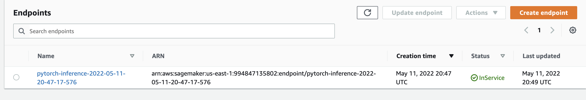
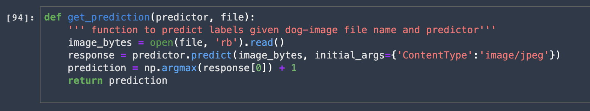
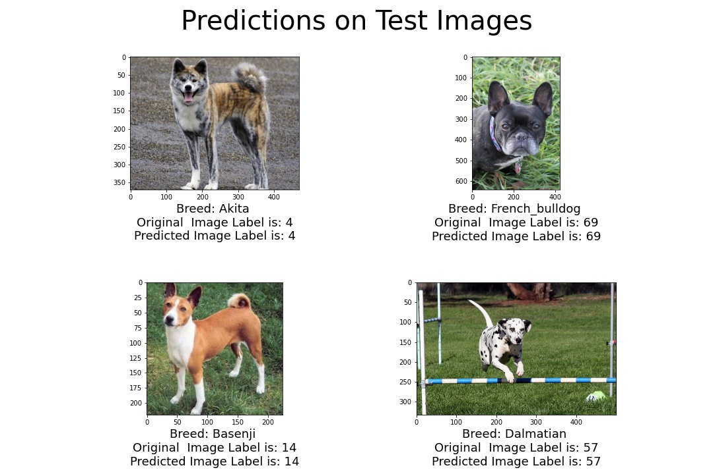

# Dog Breed Classification using Transfer Learning in AWS Sagemaker

## INTRODUCTION
-----------------------------------------------------------------------------------------------------

The ultimate goal of this project is to predict dog breeds from corresponding images of dogs.

While this is a straightforward project requirement, efforts have been made to incorporate elements of hyperparameter tuning and optimization, debugging & profiling, transfer learning, endpoint deployment and inferencing in the solution.

Thus the underlying purpose being to get accustomed with the various Sagemaker features viz. HyperparameterTuner, Estimator, DebuggerHookConfig, ProfilerConfig, Predictor.

These points makes this a holistic project to understand the fundamentals of Machine Learning in AWS Sagemaker.

**Please refer to the contents of this project if you are looking to understand any of the following:**

A) How to use Sagemaker Hyperparamter Tuning Jobs to optimize model hyperparameters?

B) How to attach Sagemaker debugging and profiling hooks to monitor various performace metrics DURING the model training phase

C) Deploy a model to a Sagemaker Endpoint using the model.tar file

D) Query a deployed endpoint to derive inferences on your trained model

## PROJECT SETUP INSTRUCTIONS
-----------------------------------------------------------------------------------------------------

1) Clone this repository in AWS Sagemaker (both Studio and Notebook instances work)

2) Notebook is divided into sections for each topic

3) Complete each section by running the cells

**NOTE:** Change the number of instances and instance types configured in the hyperparameter tuning jobs as per AWS budget.

## FILE INFO
-----------------------------------------------------------------------------------------------------

Explanations of the different files used in the project

train_and_deploy.pynb  --> python notebook with main code

hpo.py --> entry point script used by the hyperparameter tuning jobs

train_model.py --> entry point script used by the final training job

code/pretrained_model.py --> entry script used when querying the deployed endpoint for predictions

code/requirements.txt --> dependencies to install when initializing the instance on 

    
## QUERYING AN ENDPOINT SAMPLE
-----------------------------------------------------------------------------------------------------

Deployed endpoint in service

Code sample for querying a model endpoint

Test Predictions

    
## INSIGHTS
-----------------------------------------------------------------------------------------------------
Each iteration of the hyperparameter tuning job focused on improving the accuracy(as defined in the optimization of `objective_metric_name`)

The CPU utilization metric as captured by the debugging hook:

**NOTE:** An effort was made previously to accomplish the classification task using a `resnet18` model. However, both the training and testing inferences by this model were inaccurate. This indicated that the underlying model is not able to handle the complexity of the classification problem.

## REFERENCES
-----------------------------------------------------------------------------------------------------

https://sagemaker-examples.readthedocs.io/en/latest/frameworks/pytorch/get_started_mnist_deploy.html

https://sagemaker.readthedocs.io/en/stable/frameworks/pytorch/using_pytorch.html#model-directory-structure

https://datascience.stackexchange.com/questions/63070/attributeerror-numpy-ndarray-object-has-no-attribute-img-to-array

https://machinelearningmastery.com/learning-curves-for-diagnosing-machine-learning-model-performance/

## ACKNOWLEDGEMENTS
-----------------------------------------------------------------------------------------------------

Credits to Udacity for the [DogImages Dataset](https://s3-us-west-1.amazonaws.com/udacity-aind/dog-project/dogImages.zip) and the guidelines to complete this project as part of the AWS ML Engineer Nanodegree Program
